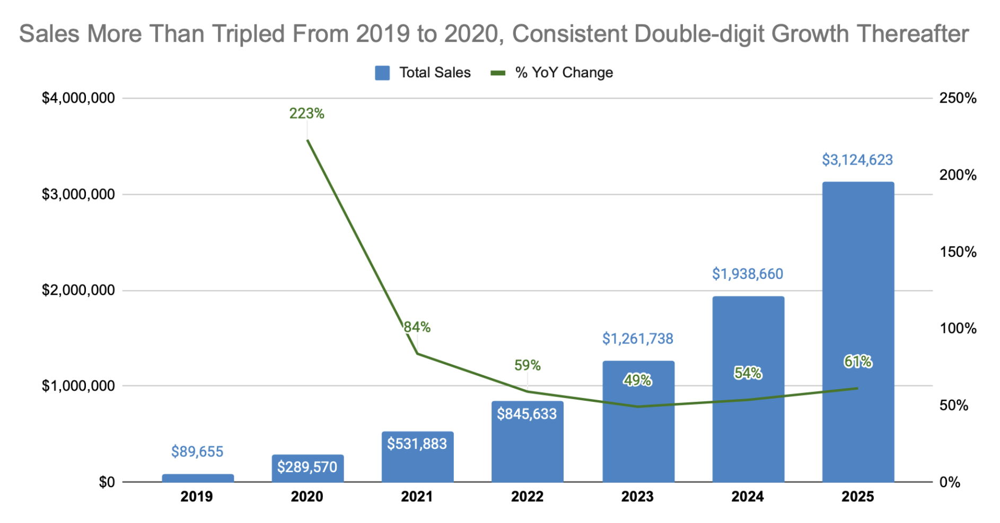
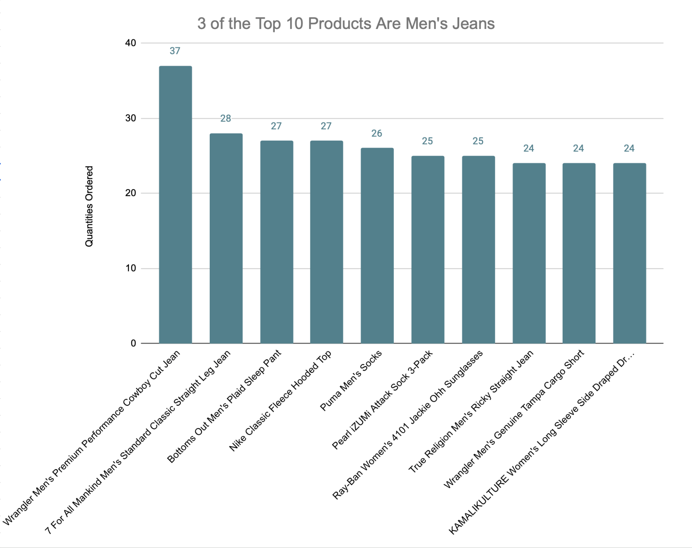
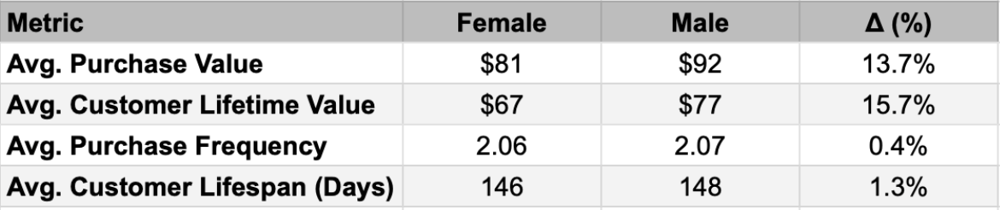
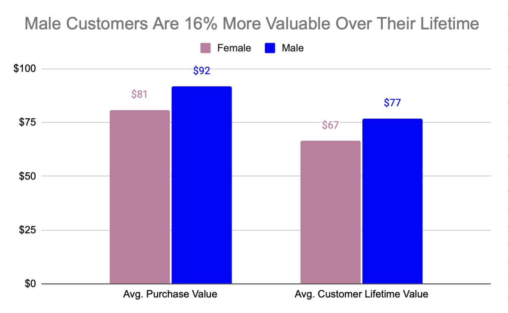

# E-commerce Sales and Customer Analysis

## Project Overview
Analysis of an e-commerce company's sales data to identify revenue trends, product performance, and customer behavior patterns. This project demonstrates SQL skills in data analysis, trend identification, and business intelligence reporting.

## Business Questions
- What are the current sales trends and how do they compare to previous periods?
- Which products are top performers and which are underperforming?
- What is the average purchase value and how can it be increased?
- What is the customer lifetime value and how does it vary by customer segment?

## Data Source
- **Dataset**: BigQuery Public Dataset `bigquery-public-data.thelook_ecommerce`
- **Analysis Date**: October 2025
- **Note**: Dataset is continually updated, so results may vary slightly when reproduced

## Key Findings

### 📈 Sales Performance
- Sales more than tripled from 2019 to 2020, with consistent double-digit growth in subsequent years
- Strong year-over-year growth indicates healthy business expansion

### 🏆 Product Performance
- **Top Products**: 3 of the top 10 products are Men's Jeans, indicating a strong category
- **Underperformers**: Over 1,000 products sold only one unit, suggesting inventory optimization opportunities

### 💰 Customer Value Metrics
- **Average Purchase Value**: $86 per order
- **Customer Lifetime Value**: $128 per customer
- **Purchase Frequency**: Average of 2 purchases per customer
- **Average Customer Lifespan**: 262 days

### 👥 Customer Segmentation
- **Gender Analysis**:
  - Men have higher average purchase value ($92 vs $81 for women)
  - Men show higher customer lifetime value ($77 vs $67 for women)
  - Both segments have similar purchase frequency and customer lifespan

## Recommendations

1. **Target Male Customers**: Focus marketing efforts on male demographic to increase average purchase value
2. **Optimize Product Portfolio**: Review underperforming products (1,000+ single-sale items) for potential discontinuation
3. **Leverage Top Categories**: Expand Men's Jeans collection and promote similar high-performing categories
4. **Customer Retention**: Implement strategies to increase purchase frequency across all segments

## Technical Skills Demonstrated

- **SQL Functions**: Window functions (LAG), aggregate functions, date functions
- **Data Analysis**: Trend analysis, cohort analysis, performance benchmarking
- **Business Intelligence**: KPI calculation (CLV, average order value), segmentation analysis
- **Data Modeling**: Temporary tables, joined datasets across multiple tables

## SQL Files
- `ecommerce_analysis.sql` - Complete analysis with all queries and comments

## How to Run
1. Access BigQuery with the `thelook_ecommerce` dataset
2. Execute queries in sequence from the SQL file
3. Results may vary slightly due to dataset updates
